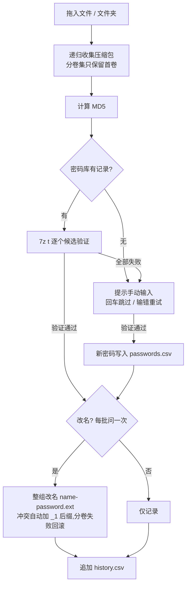

# archive-password-match

拖拽即用的 Windows 小工具:按压缩包的 **MD5** 从本地密码库匹配解压密码,用 7-Zip 实际验证,
通过后把密码追加到文件名(如 `archive.zip → archive-密码.zip`),从此不用再翻聊天记录找密码。

没匹配到的包会当场提示你输入密码,验证通过自动存入密码库——用得越多,库越全。

纯 PowerShell + bat 实现,无需安装、无依赖框架、数据全部本地。

## 功能特性

- **拖拽即用**:压缩包(可多选)或整个文件夹拖到 bat 上就开始处理
- **MD5 精确匹配**:文件内容不变,改名/挪位置都不影响匹配
- **真实验证**:用 `7z t` 实测密码,不是只看记录,错误密码不会污染文件名
- **交互式补录**:库里没有的包提示输入,验证通过自动写入密码库
- **同批复用**:一次拖入多个同密码的包只需输入一次
- **分卷支持**:`.7z.001` / `.part1.rar` / `.z01` / `.r00` / `.001` 等分卷整组一起改名,失败自动回滚
- **幂等**:文件名里已带密码的自动跳过,重复拖不会叠加后缀
- **抗特殊字符**:含空格、`&`、`!` 的文件名照常工作
- **完整历史**:每次处理结果追加到 `history.csv`

## 环境要求

- Windows 10/11(自带 PowerShell 5.1 即可)
- [7-Zip](https://www.7-zip.org/)(安装到默认位置或加入 PATH 即可被自动找到)

## 快速开始

1. 下载或克隆本仓库到任意目录
2. 把压缩包(或装满压缩包的文件夹)拖到 `MatchRename.bat` 上
3. 按提示操作:
   - 库里没记录 → 输入密码(回车跳过,输错可重试),验证通过自动入库
   - 是否改名 → 问一次,整批生效(直接回车 = 改名)

首次运行会自动创建 `passwords.csv`,不需要手动建库。

### 运行示例

```
密码库: 8 条记录 / 8 个 MD5
待处理: 2 个压缩包

[?] something.zip — 密码库无记录  md5=809797b5aaf3c8c8e4b91e9948393556
    输入密码(直接回车跳过): mypassword
[记录] something.zip 的密码已写入密码库
要把密码追加到文件名吗? [Y=改名 / n=只记录密码] (本次拖入统一生效): y
[成功] something.zip -> something-mypassword.zip  密码=mypassword
[成功] other.7z.001 -> other-mypassword.7z.001  密码=mypassword (分卷 x4 整组改名)

完成: 改名 2 | 仅记录 0 | 失败 0 | 无记录 0 | 错误 0
```

## 密码库格式(passwords.csv)

```csv
md5,password,note
1f9d1896eefcc06fd85dae2b773ab53b,mypassword,可选备注
1f9d1896eefcc06fd85dae2b773ab53b,backup-pwd,同一 MD5 可多行 = 多个候选密码按行序尝试
```

- `md5`:压缩包**文件本身**的 MD5(32 位十六进制,大小写均可)
- `password`:含逗号或引号时用 CSV 标准引号包裹(工具自动写入的都已处理好)
- `note`:随意,工具自动写入的记录标 `manual 日期`
- 参考 `passwords.example.csv`;文件可以用 Excel 或记事本直接编辑

不知道文件 MD5?直接拖上去,工具会显示出来(`[?] xxx — 密码库无记录 md5=...`)。

## 命令行用法

```powershell
powershell -NoProfile -File MatchRename.ps1 [-NoPrompt] [-Rename ask|yes|no] <路径> [<路径>...]
```

| 参数 | 说明 |
|---|---|
| `<路径>...` | 压缩包文件或目录(目录按扩展名递归扫描),可混合多个 |
| `-NoPrompt` | 不做任何询问:没匹配到的直接跳过,适合脚本/计划任务 |
| `-Rename yes` | 验证通过一律改名,不询问 |
| `-Rename no` | 只记录/验证密码,不改文件名 |

## 工作原理



## 自定义

打开 `MatchRename.ps1`,配置都在顶部:

| 配置 | 默认 | 说明 |
|---|---|---|
| `$RenameTemplate` | `{name}-{password}{ext}` | 改名模板,占位符 `{name}` `{password}` `{ext}` `{md5}` |
| `$ScanExtensions` | zip/7z/rar/tar/gz/bz2/xz/tgz/iso/cab | 扫描目录时认哪些扩展名(分卷命名总是会被识别) |

**7-Zip 不在默认位置?** 在脚本同目录新建 `7z-path.local.txt`,第一行写 7z.exe 完整路径,
例如 `D:\Tools\7-Zip\7z.exe`。该文件已被 gitignore,不会被提交。

## 隐私说明

`passwords.csv`(真实密码)、`history.csv`(本机文件路径)、`*.local.txt`(本机配置)
均在 `.gitignore` 中,**不会进入仓库**。fork/clone 后请保持这一约定。

## 常见问题

**改名后分卷还能解压吗?**
能。分卷是整组按同一规则改名的(仅改 base 部分,卷号后缀不动),且改名前密码已验证。

**密码里有 Windows 文件名非法字符(`\/:*?"<>|`)怎么办?**
改名时这些字符替换为 `_`,密码库里存的仍是原始密码。

**为什么用 MD5 而不是文件名匹配?**
文件名经常被下载工具/网盘改动,内容的 MD5 不会变;而且同一个包不管叫什么名字都能匹配到。

**会修改压缩包内容吗?**
不会。工具只做「读取 + 验证 + 重命名」,从不写入或解压文件内容。

## License

MIT
